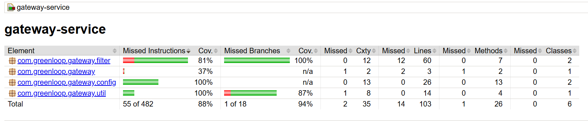

# GreenLoop Gateway Service

**Spring Cloud Gateway** that routes requests to downstream microservices, validates JWTs, and enriches requests with user information.

---

## 📖 API Documentation

The Gateway service includes **Javadoc-generated API documentation** for all public classes and methods.

- **Location:** [`docs/apidocs/index.html`](./docs/apidocs/index.html)
- **Usage:** View endpoints, method signatures, and comments for developers integrating or contributing to the Gateway.
- **Example:** Open directly in your browser:

```bash
# From repo root
open docs/apidocs/index.html   # Mac/Linux
start docs\apidocs\index.html # Windows
````

> 💡 Keep this folder updated by running: `mvn javadoc:javadoc`

---

## 📊 Test Coverage

The project includes comprehensive unit tests with coverage reports. Current coverage: **88%**



---

## 🔑 Description

The Gateway service acts as the **entry point for all API requests**, with responsibilities including:

* Decoding cookies and extracting JWT tokens.
* Validating JWTs using the configured secret.
* Adding headers for downstream services:

  * `X-User-ID` — user identifier
  * `X-User-Role` — user role
  * `X-User-Email` — user email
* Routing requests to appropriate services (Auth Service, etc.).

Centralizing authentication ensures downstream services don’t need to handle JWT parsing or user info extraction.

---

## 🚀 Getting Started

### Prerequisites

* Docker & Docker Compose
* Java 21
* Maven (wrapper included)
* `.env` file (see Configuration)

### Environment Variables

Create `.env` in the gateway folder:

```env
# JWT Configuration
JWT_SECRET=your-base64-encoded-secret
JWT_COOKIE_NAME=jwt_token

# Service URLs (use localhost for local dev, service names for Docker)
AUTH_SERVICE_URL=http://auth-service:8081
USER_SERVICE_URL=http://user-service:8082
EVENT_SERVICE_URL=http://event-service:8083

# CORS
CORS_ALLOWED_ORIGINS=http://localhost:3000
```

### Running Services

**With Docker Compose**

```bash
docker-compose up --build   # Build & start
docker-compose up           # Start without rebuild
docker-compose up -d        # Start in background
docker-compose down         # Stop containers
docker-compose down -v      # Stop & remove volumes
```

**Locally (Development)**

```bash
./mvnw clean package
./mvnw spring-boot:run
# Or run JAR directly
java -jar target/gateway-service-0.0.1-SNAPSHOT.jar
```

---

## ⚙️ Configuration

### Application Properties

* **Server Port:** `server.port=8080`
* **Service URLs:** From environment variables
* **JWT Settings:** Secret & cookie name
* **CORS Origins:** Allowed frontend domains
* **Logging:** Console output with timestamps

### Route Configuration

Defined in `GatewayConfig.java`:

```java
.route("auth-service", r -> r.path("/api/auth/**")
    .filters(f -> f.filter(filter))
    .uri(authServiceUrl))
```

To add a route, update the `routes()` method.

---

## 🧪 Testing

**Run Tests**

```bash
./mvnw test                 # All tests
./mvnw test jacoco:report   # Tests + coverage
./mvnw test -Dtest=JwtUtilTest # Specific test
```

**Unit Test Highlights**

* `JwtUtilTest` — JWT validation & parsing
* `RouterValidatorTest` — Endpoint security
* `AuthenticationFilterTest` — Auth filter logic
* `GatewayConfigTest` — Route configuration
* `CorsGlobalConfigTest` — CORS checks

---

## 🔒 Security

### JWT Validation

* Secured endpoints require valid JWT tokens.
* Tokens extracted from HTTP cookies (configurable name).
* Signature verification uses HMAC-SHA.
* Expired tokens are rejected with specific errors.

### Best Practices Implemented

✅ Non-root Docker user
✅ Input validation & null checks
✅ Detailed error messages
✅ CORS restrictions
✅ Health checks
✅ Centralized authentication

### Recommendations for Production

1. Use strong JWT secrets (≥256 bits)
2. Restrict CORS to specific domains
3. Enable HTTPS/TLS
4. Implement rate limiting
5. Monitor failed auth attempts
6. Rotate JWT secrets regularly
7. Consider token blacklisting on logout

---

## 📊 Monitoring

**Health Endpoints**

```bash
curl http://localhost:8080/actuator/health
curl http://localhost:8080/actuator/info
```

**Docker Health Check**

```dockerfile
HEALTHCHECK --interval=30s --timeout=3s --start-period=40s --retries=3 \
  CMD wget --no-verbose --tries=1 --spider http://localhost:8080/actuator/health || exit 1
```

**Logging**

* Auth attempts
* Token validation errors
* Route configuration
* Request processing errors

```bash
docker logs gateway -f
./mvnw spring-boot:run
```

---

## 📝 Notes

### Adding New Microservices

1. Add service URL to `.env`
2. Add property to `application.properties`
3. Update `GatewayConfig.java` routes
4. Add to `docker-compose.yml` if needed

### Whitelist Public Endpoints

Update `RouterValidator.java`:

```java
public static final List<String> openApiEndpoints = List.of(
    "/api/auth/signup",
    "/api/auth/login",
    "/api/your-new-public-endpoint"
);
```

### Code Quality

* ✅ Javadoc for all public classes/methods
* ✅ Unit tests
* ✅ Input validation & null checks
* ✅ Security-first approach
* ✅ Docker best practices

---

## 👥 Contributing

1. Add Javadoc for new classes/methods
2. Write unit tests
3. Update README for new features
4. Follow existing code style
5. Test with Docker Compose

---

**GreenLoop Gateway Service** | Version 1.0 | Java 21 | Spring Boot 3.2.5